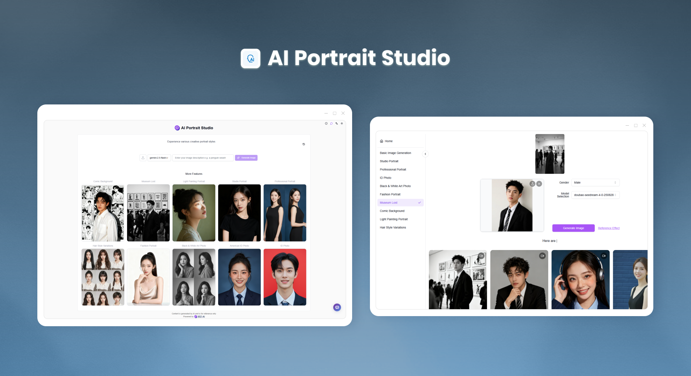
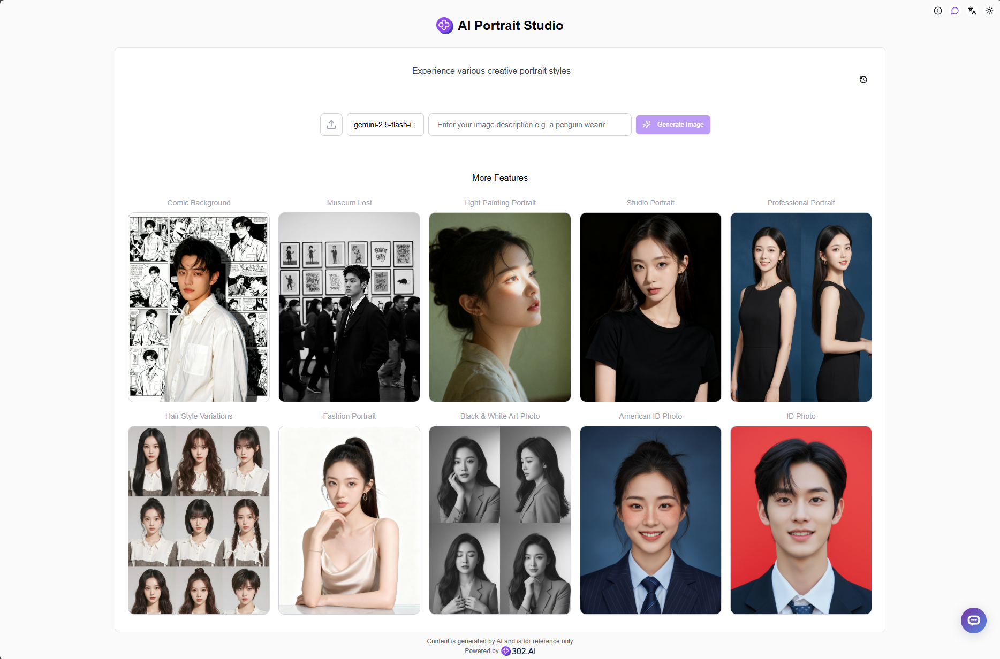
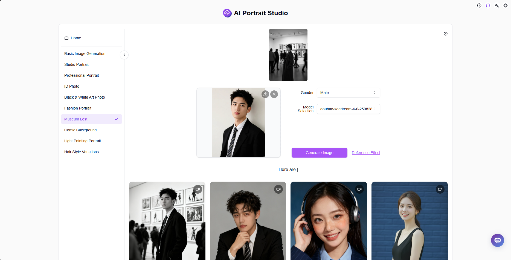

# <p align="center"> 👤 AI Portrait Studio 🚀✨</p>

<p align="center">AI Portrait Studio uses Nano-Banana or Seedream4.0 to generate images, providing various portrait creative modes for users to choose and experience</p>

<p align="center"><a href="https://302.ai/product/detail/2484" target="blank"></a></p >

<p align="center"><a href="README_zh.md">中文</a> | <a href="README.md">English</a> | <a href="README_ja.md">日本語</a></p>



This is the open-source version of the [AI Portrait Studio](https://302.ai/product/detail/2484) from [302.AI](https://302.ai/en/). You can directly log in to 302.AI to use the online version with zero code and zero background, or modify and deploy it yourself according to your requirements.

## Interface Preview
The homepage of AI Portrait Studio randomly displays various portrait creative modes, click to experience each mode. More interesting portrait modes will be continuously updated in the future!      


In addition to portrait creative modes, we also provide basic text-to-image generation and style modification. We also provide complete history recording functionality for easy viewing and management of generation records.
       

## Project Features
### 👤 Rich Portrait Creative Modes
Provides various portrait creative modes to meet different scenarios of portrait generation needs.
### 🖼️ Basic Image Generation
Supports basic functions such as text-to-image generation and image modification.
### 🎯 One-Click Experience
Simple and intuitive interface design, click to experience different portrait creative modes.
### 📝 History Records
Complete history recording functionality for easy viewing and management of generation records.
### 🌍 Multi-language Support
- Chinese Interface
- English Interface
- Japanese Interface

## 🚩 Future Update Plans
- [ ] Add more portrait creative modes

## 🛠️ Tech Stack

- **Framework**: Next.js 14
- **Language**: TypeScript
- **Styling**: TailwindCSS
- **UI Components**: Radix UI
- **State Management**: Jotai
- **Form Handling**: React Hook Form
- **HTTP Client**: ky
- **i18n**: next-intl
- **Theming**: next-themes
- **Code Standards**: ESLint, Prettier
- **Commit Standards**: Husky, Commitlint

## Development & Deployment
1. Clone the project
```bash
git clone https://github.com/302ai/302_ai_portraithub
cd 302_ai_portraithub
```

2. Install dependencies
```bash
pnpm install
```

3. Configure environment
```bash
cp .env.example .env.local
```
Modify the environment variables in `.env.local` as needed.

4. Start development server
```bash
pnpm dev
```

5. Build for production
```bash
pnpm build
pnpm start
```

## ✨ About 302.AI ✨
[302.AI](https://302.ai/en/) is an enterprise-oriented AI application platform that offers pay-as-you-go services, ready-to-use solutions, and an open-source ecosystem.✨
1. 🧠 Comprehensive AI capabilities: Incorporates the latest in language, image, audio, and video models from leading AI brands.
2. 🚀 Advanced application development: We build genuine AI products, not just simple chatbots.
3. 💰 No monthly fees: All features are pay-per-use, fully accessible, ensuring low entry barriers with high potential.
4. 🛠 Powerful admin dashboard: Designed for teams and SMEs - managed by one, used by many.
5. 🔗 API access for all AI features: All tools are open-source and customizable (in progress).
6. 💡 Powerful development team: Launching 2-3 new applications weekly with daily product updates. Interested developers are welcome to contact us.