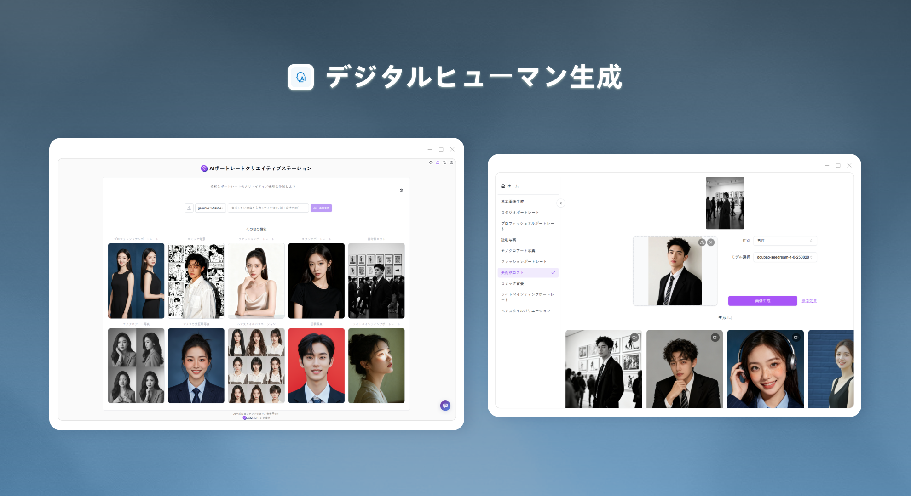
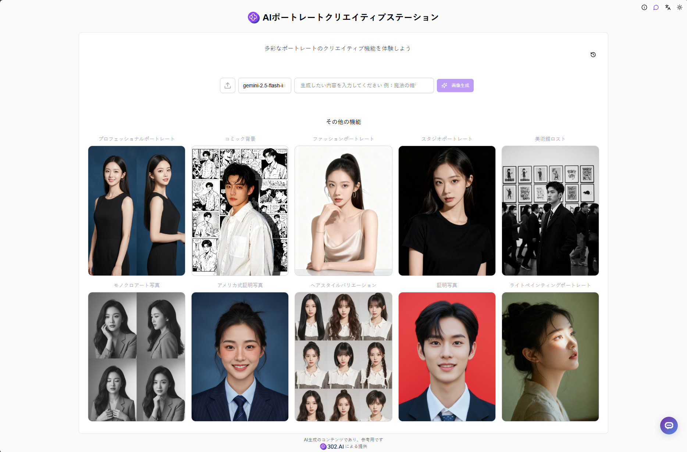
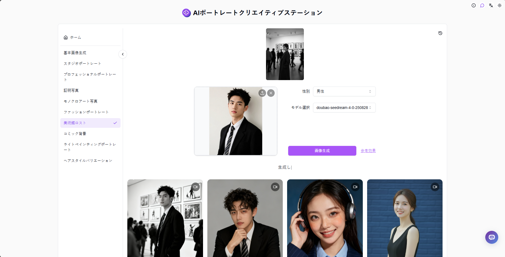

# <p align="center"> 👤 AIポートレートクリエイティブステーション 🚀✨</p>

<p align="center">AIポートレートクリエイティブステーションはNano-BananaまたはSeedream4.0を使用して画像を生成し、ユーザーが選択して体験できる様々なポートレートクリエイティブ機能を提供します</p>

<p align="center"><a href="https://302.ai/product/detail/2484" target="blank"></a></p >

<p align="center"><a href="README_zh.md">中文</a> | <a href="README.md">English</a> | <a href="README_ja.md">日本語</a></p>



[302.AI](https://302.ai/ja/)の[AIポートレートクリエイティブステーション](https://302.ai/product/detail/2484)のオープンソース版です。
302.AIに直接ログインすることで、コード不要、設定不要のオンライン体験が可能です。
あるいは、このプロジェクトをニーズに合わせてカスタマイズし、302.AIのAPI KEYを統合して、自身でデプロイすることもできます。

## インターフェースプレビュー
AIポートレートクリエイティブステーションのホームページでは、様々なポートレートクリエイティブ機能がランダムに表示され、クリックするとその機能を体験できます。今後もより多くの興味深いポートレート機能が継続的に更新される予定です！      


ポートレートクリエイティブ機能に加えて、基本的なテキストから画像生成やスタイル変更も提供しています。また、完全な履歴記録機能も提供しており、生成記録をいつでも簡単に確認・管理できます。
                  

## プロジェクトの特徴
### 👤 豊富なポートレートクリエイティブ機能
様々なポートレートクリエイティブ機能を提供し、異なるシーンでのポートレート生成ニーズを満たします。
### 🖼️ 基本画像生成
テキストから画像生成や画像修正などの基本機能をサポートします。
### 🎯 ワンクリック体験
シンプルで直感的なインターフェースデザインで、クリックするだけで異なるポートレートクリエイティブ機能を体験できます。
### 📝 履歴記録
完全な履歴記録機能により、生成記録の確認と管理が簡単にできます。
### 🌍 多言語サポート
- 中国語インターフェース
- 英語インターフェース
- 日本語インターフェース

## 🚩 将来のアップデート計画
- [ ] より多くのポートレートクリエイティブ機能を追加

## 🛠️ 技術スタック

- **フレームワーク**: Next.js 14
- **言語**: TypeScript
- **スタイリング**: TailwindCSS
- **UIコンポーネント**: Radix UI
- **状態管理**: Jotai
- **フォーム処理**: React Hook Form
- **HTTPクライアント**: ky
- **国際化**: next-intl
- **テーマ**: next-themes
- **コード規約**: ESLint, Prettier
- **コミット規約**: Husky, Commitlint

## 開発&デプロイ
1. プロジェクトのクローン
```bash
git clone https://github.com/302ai/302_ai_portraithub
cd 302_ai_portraithub
```

2. 依存関係のインストール
```bash
pnpm install
```

3. 環境設定
```bash
cp .env.example .env.local
```
必要に応じて`.env.local`の環境変数を修正してください。

4. 開発サーバーの起動
```bash
pnpm dev
```

5. プロダクションビルド
```bash
pnpm build
pnpm start
```

## ✨ 302.AIについて ✨
[302.AI](https://302.ai/ja/)は企業向けのAIアプリケーションプラットフォームであり、必要に応じて支払い、すぐに使用できるオープンソースのエコシステムです。✨
1. 🧠 包括的なAI機能：主要AIブランドの最新の言語、画像、音声、ビデオモデルを統合。
2. 🚀 高度なアプリケーション開発：単なるシンプルなチャットボットではなく、本格的なAI製品を構築。
3. 💰 月額料金なし：すべての機能が従量制で、完全にアクセス可能。低い参入障壁と高い可能性を確保。
4. 🛠 強力な管理ダッシュボード：チームやSME向けに設計 - 一人で管理し、多くの人が使用可能。
5. 🔗 すべてのAI機能へのAPIアクセス：すべてのツールはオープンソースでカスタマイズ可能（進行中）。
6. 💪 強力な開発チーム：大規模で高度なスキルを持つ開発者集団。毎週2-3の新しいアプリケーションをリリースし、毎日製品更新を行っています。才能ある開発者の参加を歓迎します。